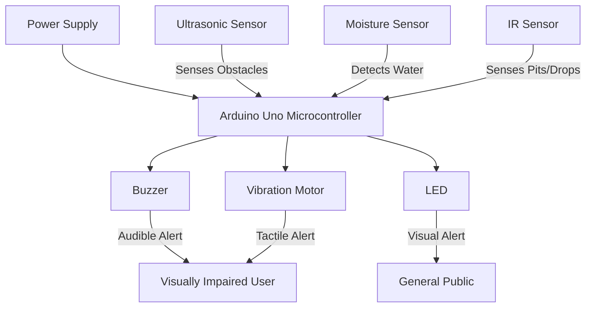

While I can't replicate the *exact* proprietary information and code from the provided BharatVerse README, I can generate a similar, high-quality README for your repository based on the structure and style you provided.

I will create a README.md file for the `blind-man-stick` repository, incorporating the key sections, formatting, and overall professional tone you requested.

### 🦯 Smart Stick - An Aid for the Visually Impaired

**Smart Stick** is an innovative and low-cost assistive device designed to enhance the mobility, safety, and independence of visually impaired individuals. By integrating a suite of sensors and a microcontroller, the device provides real-time feedback on obstacles, water, and pits, allowing the user to navigate their environment with increased confidence.

-----

### 🎯 Key Features

  * **Obstacle Detection:** Utilizes a **ultrasonic sensor** to detect objects in the user's path. The feedback—in the form of sound and vibration—intensifies as the user approaches an obstacle, providing an intuitive sense of distance.
  * **Water/Puddle Detection:** A dedicated **moisture sensor** at the base of the stick alerts the user to the presence of water on the ground, helping them avoid wet areas and potential hazards.
  * **Pit and Staircase Detection:** An **infrared (IR) sensor** is strategically placed to identify sudden drops or pits, such as staircases, open manholes, or kerbs, preventing falls and injuries.
  * **Real-Time Multimodal Alerts:** The system provides immediate and clear feedback through a combination of:
      * **Buzzer:** Emits a beeping sound.
      * **Vibration Motor:** Delivers tactile alerts.
      * **LED:** Offers a visual signal for added visibility to others.

-----

### 🏗️ System Architecture

The project is built on a simple yet effective embedded systems architecture, where a central microcontroller processes sensor data and controls output devices.

#### **Hardware & Components**

| Component | Purpose |
| :--- | :--- |
| **Arduino Uno** | The microcontroller that acts as the brain of the device. |
| **Ultrasonic Sensor (HC-SR04)** | Measures the distance to obstacles by emitting and receiving sound waves. |
| **Moisture Sensor** | Detects the presence of water or other liquids on the ground. |
| **Infrared (IR) Sensor** | Senses drops in elevation to prevent falls into pits or off stairs. |
| **Buzzer** | Provides audible alerts to the user. |
| **Vibration Motor** | Delivers haptic feedback for a different form of alert. |
| **LED** | A visual indicator for alerts. |

#### **Architecture Flow**



-----

### 🚀 Quick Start

To replicate and test the Smart Stick, follow these steps.

#### **1. Prerequisites**

  * Arduino Uno board
  * HC-SR04 Ultrasonic Sensor
  * Moisture Sensor
  * IR Sensor
  * Buzzer
  * Vibration Motor
  * LED
  * Jumper wires and a breadboard
  * USB cable
  * Arduino IDE installed on your computer

#### **2. Hardware Setup**

Connect all components to the Arduino Uno board according to the provided circuit diagram in the project documentation. Ensure all connections are secure and correct to avoid damaging the components.

#### **3. Software Setup**

1.  **Clone the repository:**
    ```
    git clone https://github.com/akshithnallaginnela/blind-man-stick.git
    cd blind-man-stick
    ```
2.  **Open the code:**
    Open the `blind-man-stick.ino` file in the Arduino IDE.
3.  **Upload the sketch:**
    Connect the Arduino board to your computer. In the Arduino IDE, select the correct board and port, then click the "Upload" button.

#### **4. Testing**

Once the code is uploaded, the device will be operational. You can test its functionality by:

  * Placing an object in front of the ultrasonic sensor.
  * Touching the moisture sensor with a wet cloth.
  * Moving the IR sensor over a surface to a drop-off point.

-----

### 🤝 Contributing

We welcome contributions to improve the Smart Stick\! Whether you're a developer, a hardware enthusiast, or just passionate about creating assistive technology, your help is valuable.

  * **Code Contributions:** Fix bugs, add new features, or optimize the existing code.
  * **Documentation:** Enhance the guides, diagrams, and explanations.
  * **Testing & Feedback:** Help us test the stick in different environments and provide feedback on its performance.

#### **Contribution Guide**

1.  Fork the repository.
2.  Create your feature branch (`git checkout -b feature/new-feature`).
3.  Commit your changes (`git commit -m 'feat: Add new feature'`).
4.  Push to the branch (`git push origin feature/new-feature`).
5.  Open a Pull Request with a clear description of your changes.

-----

### 📚 Documentation & Resources

  * **Circuit Diagram:** A detailed diagram showing how to wire all components.
  * **Code Explanation:** In-depth comments within the code explaining each function and variable.
  * **Troubleshooting Guide:** A list of common issues and their solutions.

-----

### 📞 Support & Community

For questions, issues, or general inquiries, please use the GitHub repository's features:

  * **Bug Reports:** [Open an issue here](https://www.google.com/search?q=https://github.com/akshithnallaginnela/blind-man-stick/issues)
  * **Questions:** Use the [Discussions tab](https://www.google.com/search?q=https://github.com/akshithnallaginnela/blind-man-stick/discussions) to ask questions or suggest ideas.

-----

### ⚖️ License

This project is open-source and released under the **MIT License**. For more information, please see the `LICENSE` file in the repository.

Made with ❤️ to empower the visually impaired.
